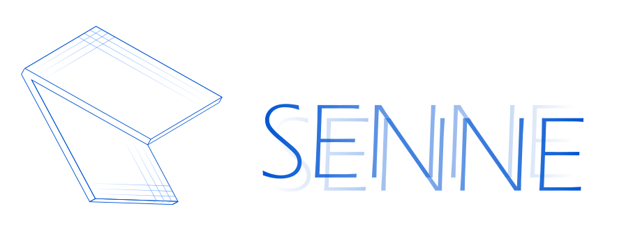

Algorithm for spatial segmentation neural networks ensembling. 

## Applications

The "competition" folder contains examples of the algorithm for the "[On Cloud N: Cloud Cover Detection Challenge](https://www.drivendata.org/competitions/83/cloud-cover/)" competition. 